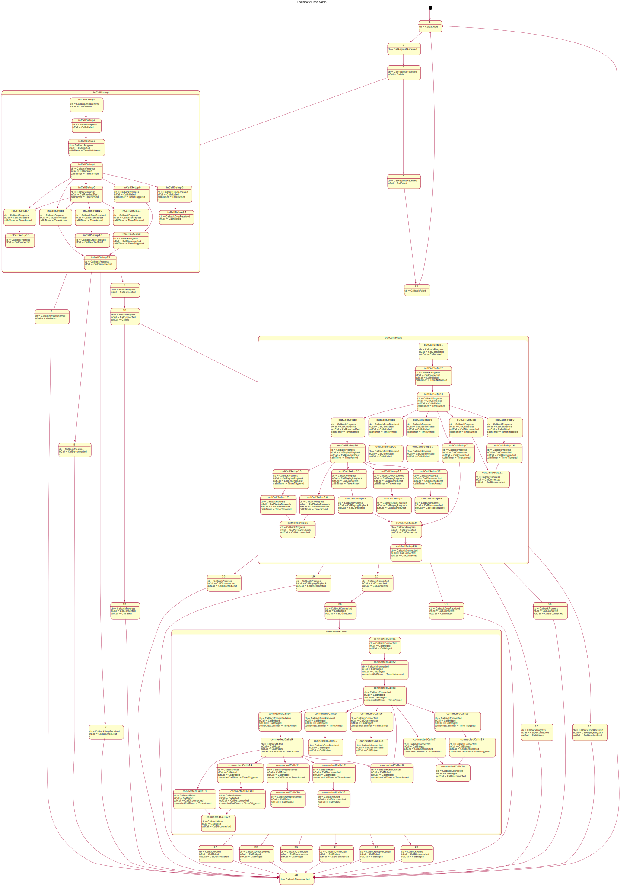

# beseder-demo-apps

## ATM control program
This demo implements control of simplified ATM. 
ATM consists of four resources:
* [Card reader](https://github.com/oofp/beseder-demo-apps/blob/master/atm-demo/src/Beseder/Atm/Resources/CardReaderRes.hs)
* [Account](https://github.com/oofp/beseder-demo-apps/blob/master/atm-demo/src/Beseder/Atm/Resources/AccountRes.hs)
* [Cash dispenser](https://github.com/oofp/beseder-demo-apps/blob/master/atm-demo/src/Beseder/Atm/Resources/CashDispenserRes.hs)
* [Terminal](https://github.com/oofp/beseder-demo-apps/blob/master/atm-demo/src/Beseder/Atm/Resources/TerminalRes.hs)

Supported operations:
* Checking account balance
* Cash withdrawal

Currently there are two alternative implementations of the program:
* [sequentional (step by step) computatition](https://github.com/oofp/beseder-demo-apps/blob/master/atm-demo/src/Beseder/Atm/AtmApp.hs

* [event loop](https://github.com/oofp/beseder-demo-apps/blob/master/atm-demo/src/Beseder/Atm/AtmLoopApp.hs)

The demo are using Beseder feature of deriving resource declaration from type class that describe resource behavior. As a bonus, it also creates state diagram that provides visual presentation of resource behavior.

### Here are state diagram for CashDispenser and Terminal resources:

###

### ATM Program example

##### State diagram of ATM program implemented as event loop. 
[AtmLoopApp.hs](!https://github.com/oofp/beseder-demo-apps/blob/master/atm-demo/src/Beseder/Atm/AtmLoopApp.hs)

This implementation is similar to traditional loop with state defined as ADT. Just that with Beseder state variants are inferred. All possible resource state combinations are shown and state transitions are shown below:

##### State diagram of of ATM program implemented as steps sequence. 
[AtmApp.hs](https://github.com/oofp/beseder-demo-apps/blob/master/atm-demo/src/Beseder/Atm/AtmApp.hs)

## Callback demo
### This demo shows web controlled setup of callback call. 
* The users enters its own phone number abd destination number
* First call reaches the caller's phone and then call is placed to destination.
* During call setup, user is listening to the ringback tone.
* Once destination answered the call, both parties are connected.
* At any time user can cancel or hang up.
* Once parties are connected, the user can mute herself.
* Web UI will be implemented using [Server Driven UI Beseder binding](https://github.com/oofp/sdui/tree/master/sdui-beseder)

#### [Outbound call resource state diagram](https://github.com/oofp/beseder-demo-apps/blob/master/callback-demo/src/Beseder/Callback/Resources/OutboundCallRes.hs) 

#### [Callback resource state diagram](https://github.com/oofp/beseder-demo-apps/blob/master/callback-demo/src/Beseder/Callback/Resources/CallbackRes.hs) 

---
#### [Callback application with timers for call setup and call duration](https://github.com/oofp/beseder-demo-apps/blob/master/callback-demo/src/Beseder/Callback/CallbackTimerApp.hs)

